# ESP32 Camera based  HomeKit IP Camera
Firmware for ESP32-Cam module to act as  Homekit IP camera.

------
  
------

**This project uses the Apple HomeKit accessory server library [ESP-HomeKit](https://github.com/maximkulkin/esp-homekit) from [@MaximKulkin](https://github.com/maximkulkin) for [ESP-IDF](https://github.com/espressif/esp-idf) from [Espressif](https://www.espressif.com).**  

# You have to install [ESP-IDF](https://docs.espressif.com/projects/esp-idf/en/stable/get-started/)!

## v0.0.1 

* MAC Address based Name / Serial Number
* Motion Sensor _(not implemented fully yet!)_

## Configuration

Before compiling, you need to alter several settings in menuconfig (`make
menuconfig`):

1. Choose `Partition Table` 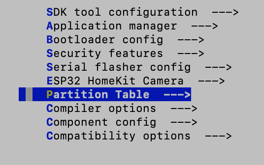
	
	Choose **(old_file.csv or nothing) Custom partition CSV file**
    	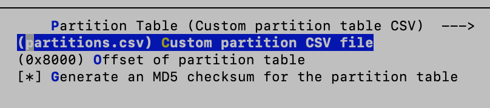
   Set **partitions.csv**
    	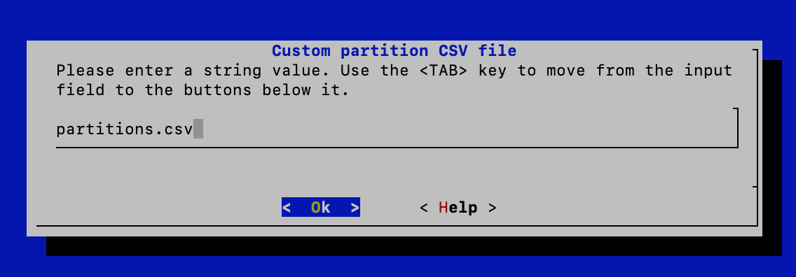
    	
2. Choose `Component config`
   Choose `ESP32-specific` 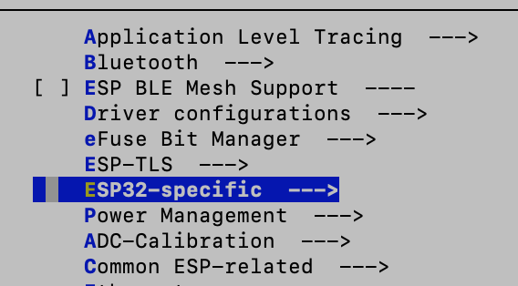
   
   **Check** `Support for external, SPI-connected RAM` and then select `SPI RAM config` menu
   
   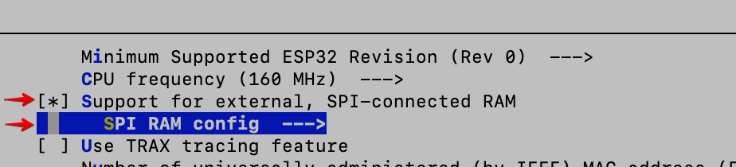
        
	**Check** `Initialize SPI RAM when booting the ESP32` and then select `SPI RAM access method`
    
    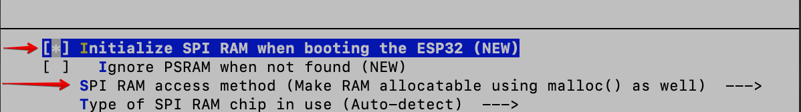
    
    **Check** `Make RAM allocatable using malloc() as well`
    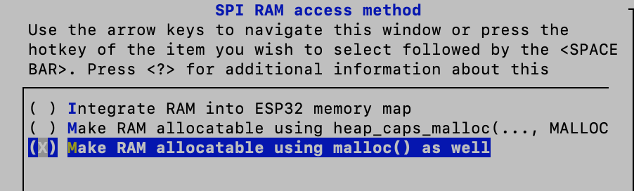
    
     and then go back to the `Component config` and choose `Camera configuration`
    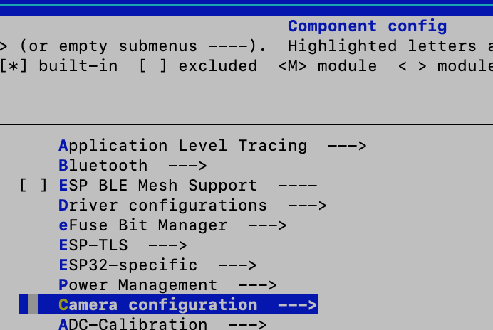
    then **check** `OV2640 Support`
    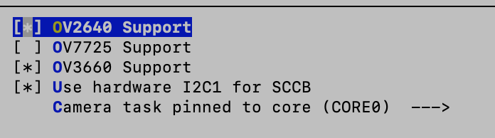
    
    Go back to the `Component config` and choose `Homekit`
    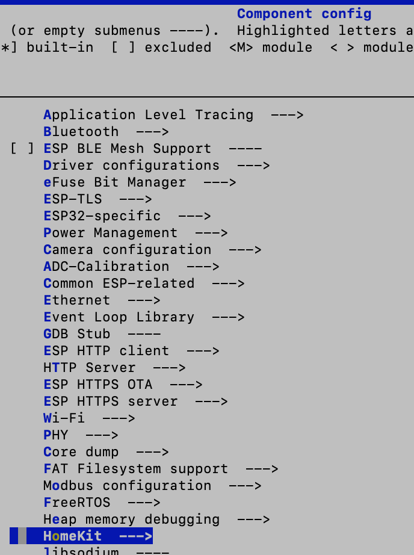
    
    then choose `SPI flash address for storing HomeKit data` and write the value `0x3A0000`
    
    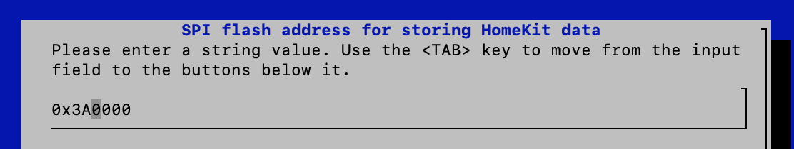
    
3. Choose `ESP32 HomeKit Camera`
	Then choose your WiFi SSID and Password
    
	Then choose `Camera Pins` in which you have to choose the `Select Camera Pinout` accordingly with [your version of ESP32 Cam module](https://github.com/HomeKidd/esp32-homekit-camera/wiki/Hardware-Setup).

Although already forbidden by the sources and subsequent licensing, it is not allowed to use or distribute this software for a commercial purpose.  

 

###### HomeKit Accessory Protocol (HAP) is Apple’s proprietary protocol that enables third-party accessories in the home (e.g., lights, thermostats and door locks) and Apple products to communicate with each other. HAP supports two transports, IP and Bluetooth LE. The information provided in the HomeKit Accessory Protocol Specification (Non-Commercial Version) describes how to implement HAP in an accessory that you create for non-commercial use and that will not be distributed or sold.

###### The HomeKit Accessory Protocol Specification (Non-Commercial Version) can be downloaded from the [HomeKit Apple Developer page.](https://developer.apple.com/homekit/)

###### Copyright © 2019 Apple Inc. All rights reserved.
